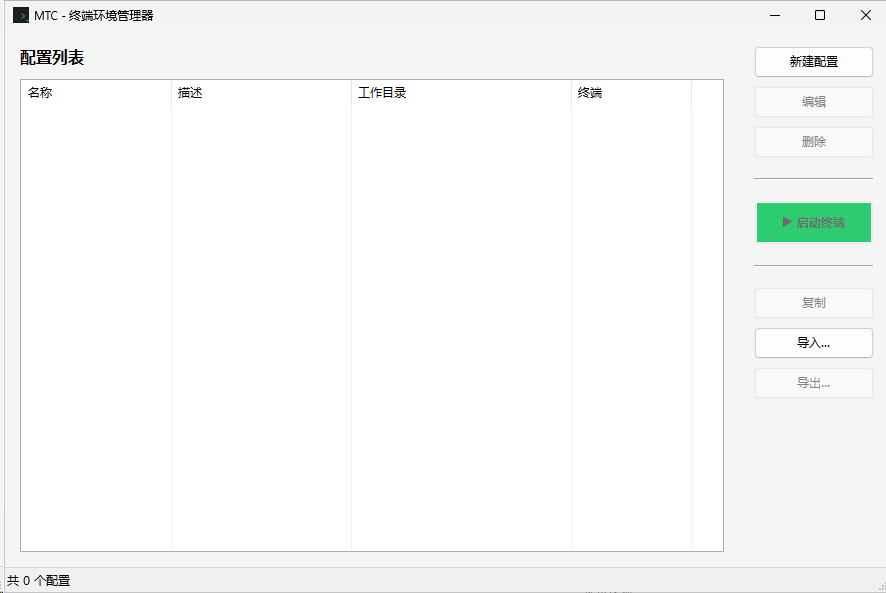
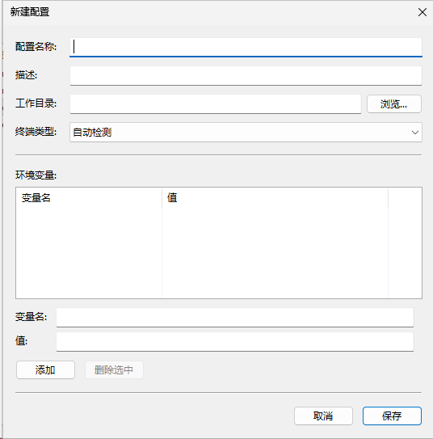

# MTC - Multi-Terminal Commander

跨平台终端环境变量管理器

## 功能

- 创建和管理多组环境变量配置
- 一键启动带有自定义环境变量的终端
- 支持 Windows Terminal、PowerShell、CMD 等多种终端
- 支持 Windows、Linux、macOS 跨平台运行
- 配置持久化存储

## 截图

<p align="center">
  
</p>

<p align="center">
  
</p>

## 下载

预编译版本可从以下位置下载：

| 平台 | GitHub | Gitee |
|------|--------|-------|
| Windows | [MTC-Windows-Release](https://github.com/cdiwit/mtc/actions) | - |
| Linux | [MTC-Linux-Release](https://github.com/cdiwit/mtc/actions) | [MTC-Linux-Release](https://gitee.com/cdiwit/mtc/gitee-go) |
| macOS (Intel) | [MTC-macOS-x64-Release](https://github.com/cdiwit/mtc/actions) | - |
| macOS (Apple Silicon) | [MTC-macOS-ARM64-Release](https://github.com/cdiwit/mtc/actions) | - |

> **说明**: GitHub 提供全平台构建，Gitee 仅提供 Linux 构建。国内用户如需 Windows/macOS 版本请访问 GitHub。

## 构建

### 依赖

- C++17 编译器
- wxWidgets 3.2+
- nlohmann/json

### Windows (使用 vcpkg)

```powershell
# 安装依赖
vcpkg install wxwidgets:x64-windows-static nlohmann-json:x64-windows-static

# 构建
mkdir build && cd build
cmake .. -DCMAKE_TOOLCHAIN_FILE=C:/vcpkg/scripts/buildsystems/vcpkg.cmake -DVCPKG_TARGET_TRIPLET=x64-windows-static
cmake --build . --config Release
```

### Linux

```bash
sudo apt-get install libwxgtk3.0-gtk3-dev nlohmann-json3-dev
mkdir build && cd build
cmake ..
make -j$(nproc)
```

### macOS

```bash
brew install wxwidgets nlohmann-json
mkdir build && cd build
cmake ..
make -j$(sysctl -n hw.ncpu)
```

## 使用

1. 运行 `mtc.exe`（Windows）或 `mtc`（Linux/macOS）
2. 点击"新建配置"创建环境变量组
3. 设置名称、工作目录和环境变量
4. 选择配置后点击"启动终端"

## 许可证

MIT License
