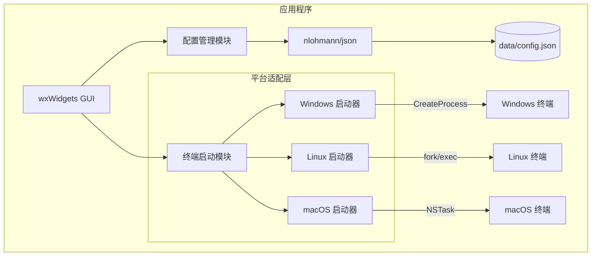

# Windows 终端环境变量管理器 (MTC - Multi-Terminal Commander)

## 项目概述

MTC 是一个跨平台的终端环境变量管理工具，允许用户创建和管理多组环境变量配置，并能够快速启动带有指定环境变量的终端窗口。

### 核心功能

1. **多组环境变量管理**：创建、编辑、删除多个环境变量配置组
2. **自定义环境变量**：为每组配置设置自定义的环境变量（如 `XXX=YYY`）
3. **环境变量覆盖**：自定义变量会覆盖系统同名环境变量
4. **工作目录指定**：为每个配置指定终端启动时的工作目录
5. **配置命名**：为每个终端环境配置赋予易于识别的名称
6. **一键启动终端**：选择配置后快速启动带有该环境变量的终端
7. **持久化存储**：所有配置保存在 `data` 文件夹中
8. **跨平台支持**：支持 Windows、Linux、macOS

---

## 技术栈

| 层级 | 技术选型 | 说明 |
|------|----------|------|
| 开发语言 | C++ (C++17) | 原生编译，无需运行环境 |
| GUI 框架 | wxWidgets 3.2+ | 跨平台原生 GUI 框架 |
| 数据存储 | JSON 文件 | 存储在 `data/config.json` |
| JSON 库 | nlohmann/json | 单头文件，易于集成 |
| 编译器 | MSVC / GCC / Clang | 支持主流编译器 |

### 技术优势

- ✅ **无运行环境依赖**：静态编译后为单个可执行文件
- ✅ **跨平台**：Windows / Linux / macOS 均支持
- ✅ **原生 UI**：使用各平台原生控件，外观一致性好
- ✅ **体积可控**：静态编译约 5-15MB
- ✅ **启动快**：原生应用，秒开

### 平台支持

| 平台 | 终端类型 | 状态 |
|------|----------|------|
| Windows | Windows Terminal, PowerShell, CMD | ✅ 支持 |
| Linux | GNOME Terminal, Konsole, xterm | ✅ 支持 |
| macOS | Terminal.app, iTerm2 | ✅ 支持 |

---

## 系统架构



---

## 数据存储设计

### 存储位置

所有配置数据持久化保存在程序目录下的 `data` 文件夹中：

```
mtc/
├── mtc.exe (或 mtc, mtc.app)
└── data/
    ├── config.json      # 主配置文件
    └── backups/         # 配置备份（可选）
        └── config_2026-01-29.json
```

### 配置文件格式 (`data/config.json`)

```json
{
  "version": "1.0",
  "profiles": [
    {
      "id": "550e8400-e29b-41d4-a716-446655440000",
      "name": "开发环境",
      "description": "Node.js 开发环境配置",
      "workingDirectory": "D:\\Projects\\my-app",
      "terminalType": "wt",
      "environmentVariables": [
        { "name": "NODE_ENV", "value": "development" },
        { "name": "API_URL", "value": "http://localhost:3000" },
        { "name": "DEBUG", "value": "true" }
      ],
      "createdAt": "2026-01-29T16:00:00+08:00",
      "updatedAt": "2026-01-29T16:00:00+08:00"
    },
    {
      "id": "550e8400-e29b-41d4-a716-446655440001",
      "name": "生产环境",
      "description": "生产构建环境配置",
      "workingDirectory": "D:\\Projects\\my-app",
      "terminalType": "powershell",
      "environmentVariables": [
        { "name": "NODE_ENV", "value": "production" },
        { "name": "API_URL", "value": "https://api.example.com" }
      ],
      "createdAt": "2026-01-29T16:00:00+08:00",
      "updatedAt": "2026-01-29T16:00:00+08:00"
    }
  ],
  "settings": {
    "defaultTerminalType": "auto",
    "language": "zh-CN",
    "theme": "system",
    "autoBackup": true
  }
}
```

### C++ 数据结构定义

```cpp
// Types.h
#pragma once
#include <string>
#include <vector>
#include <ctime>

// 环境变量结构
struct EnvVariable {
    std::string name;
    std::string value;
};

// 终端类型枚举
enum class TerminalType {
    Auto,           // 自动检测
    // Windows
    WindowsTerminal,
    PowerShell,
    Cmd,
    // Linux
    GnomeTerminal,
    Konsole,
    Xterm,
    // macOS
    TerminalApp,
    ITerm2
};

// 配置项结构
struct Profile {
    std::string id;
    std::string name;
    std::string description;
    std::string workingDirectory;
    TerminalType terminalType = TerminalType::Auto;
    std::vector<EnvVariable> environmentVariables;
    std::string createdAt;
    std::string updatedAt;
};

// 应用程序设置
struct AppSettings {
    TerminalType defaultTerminalType = TerminalType::Auto;
    std::string language = "zh-CN";
    std::string theme = "system";
    bool autoBackup = true;
};

// 完整配置
struct AppConfig {
    std::string version = "1.0";
    std::vector<Profile> profiles;
    AppSettings settings;
};
```

---

## 目录结构

```
mtc/
├── docs/
│   └── development-guide.md        # 开发文档
├── src/
│   ├── main.cpp                    # 程序入口
│   ├── App.h                       # 应用程序类
│   ├── App.cpp
│   ├── ui/
│   │   ├── MainFrame.h             # 主窗口
│   │   ├── MainFrame.cpp
│   │   ├── ProfileDialog.h         # 配置编辑对话框
│   │   ├── ProfileDialog.cpp
│   │   ├── EnvVarPanel.h           # 环境变量编辑面板
│   │   └── EnvVarPanel.cpp
│   ├── core/
│   │   ├── Types.h                 # 类型定义
│   │   ├── ConfigManager.h         # 配置管理器
│   │   ├── ConfigManager.cpp
│   │   ├── TerminalLauncher.h      # 终端启动器接口
│   │   └── TerminalLauncher.cpp
│   ├── platform/
│   │   ├── PlatformUtils.h         # 平台工具接口
│   │   ├── WindowsLauncher.cpp     # Windows 实现
│   │   ├── LinuxLauncher.cpp       # Linux 实现
│   │   └── MacLauncher.cpp         # macOS 实现
│   └── utils/
│       ├── UuidGenerator.h         # UUID 生成
│       ├── UuidGenerator.cpp
│       ├── PathUtils.h             # 路径工具
│       └── PathUtils.cpp
├── include/
│   └── nlohmann/
│       └── json.hpp                # nlohmann/json 单头文件库
├── resources/
│   ├── icons/
│   │   ├── app.ico                 # Windows 图标
│   │   ├── app.icns                # macOS 图标
│   │   └── app.png                 # Linux 图标
│   └── mtc.rc                      # Windows 资源文件
├── data/
│   └── config.json                 # 配置文件 (运行时生成)
├── build/                          # 构建输出目录
├── CMakeLists.txt                  # CMake 构建文件
├── vcpkg.json                      # vcpkg 依赖配置
└── README.md
```

---

## 核心功能实现

### 1. 配置管理器（持久化存储）

```cpp
// ConfigManager.h
#pragma once
#include "Types.h"
#include <string>
#include <filesystem>

namespace fs = std::filesystem;

class ConfigManager {
public:
    static ConfigManager& GetInstance();
    
    // 初始化（指定数据目录）
    bool Initialize(const fs::path& appDir);
    
    // 配置文件操作
    bool LoadConfig();
    bool SaveConfig();
    
    // Profile 操作
    const std::vector<Profile>& GetProfiles() const { return m_config.profiles; }
    const Profile* GetProfile(const std::string& id) const;
    
    void AddProfile(const Profile& profile);
    void UpdateProfile(const std::string& id, const Profile& profile);
    void DeleteProfile(const std::string& id);
    Profile DuplicateProfile(const std::string& id);
    
    // 导入导出
    bool ExportConfig(const fs::path& filePath);
    bool ImportConfig(const fs::path& filePath);
    
    // 设置
    const AppSettings& GetSettings() const { return m_config.settings; }
    void UpdateSettings(const AppSettings& settings);
    
    // 备份
    bool CreateBackup();
    
private:
    ConfigManager() = default;
    
    AppConfig m_config;
    fs::path m_dataDir;
    fs::path m_configPath;
    
    void EnsureDataDirectory();
    std::string GenerateUuid();
    std::string GetCurrentTimestamp();
};

// ConfigManager.cpp
#include "ConfigManager.h"
#include <nlohmann/json.hpp>
#include <fstream>
#include <iomanip>
#include <sstream>
#include <random>

using json = nlohmann::json;

ConfigManager& ConfigManager::GetInstance() {
    static ConfigManager instance;
    return instance;
}

bool ConfigManager::Initialize(const fs::path& appDir) {
    m_dataDir = appDir / "data";
    m_configPath = m_dataDir / "config.json";
    
    EnsureDataDirectory();
    return LoadConfig();
}

void ConfigManager::EnsureDataDirectory() {
    // 确保 data 目录存在
    if (!fs::exists(m_dataDir)) {
        fs::create_directories(m_dataDir);
    }
    
    // 确保备份目录存在
    fs::path backupDir = m_dataDir / "backups";
    if (!fs::exists(backupDir)) {
        fs::create_directories(backupDir);
    }
}

bool ConfigManager::LoadConfig() {
    if (!fs::exists(m_configPath)) {
        // 创建默认配置
        m_config = AppConfig();
        return SaveConfig();
    }
    
    try {
        std::ifstream file(m_configPath);
        if (!file.is_open()) {
            return false;
        }
        
        json j;
        file >> j;
        
        m_config.version = j.value("version", "1.0");
        
        // 解析 profiles
        if (j.contains("profiles")) {
            for (const auto& jp : j["profiles"]) {
                Profile profile;
                profile.id = jp.value("id", "");
                profile.name = jp.value("name", "");
                profile.description = jp.value("description", "");
                profile.workingDirectory = jp.value("workingDirectory", "");
                
                // 解析终端类型
                std::string termType = jp.value("terminalType", "auto");
                if (termType == "wt") profile.terminalType = TerminalType::WindowsTerminal;
                else if (termType == "powershell") profile.terminalType = TerminalType::PowerShell;
                else if (termType == "cmd") profile.terminalType = TerminalType::Cmd;
                else if (termType == "gnome-terminal") profile.terminalType = TerminalType::GnomeTerminal;
                else if (termType == "konsole") profile.terminalType = TerminalType::Konsole;
                else if (termType == "xterm") profile.terminalType = TerminalType::Xterm;
                else if (termType == "terminal.app") profile.terminalType = TerminalType::TerminalApp;
                else if (termType == "iterm2") profile.terminalType = TerminalType::ITerm2;
                else profile.terminalType = TerminalType::Auto;
                
                // 解析环境变量
                if (jp.contains("environmentVariables")) {
                    for (const auto& jv : jp["environmentVariables"]) {
                        EnvVariable var;
                        var.name = jv.value("name", "");
                        var.value = jv.value("value", "");
                        profile.environmentVariables.push_back(var);
                    }
                }
                
                profile.createdAt = jp.value("createdAt", "");
                profile.updatedAt = jp.value("updatedAt", "");
                
                m_config.profiles.push_back(profile);
            }
        }
        
        // 解析设置
        if (j.contains("settings")) {
            const auto& js = j["settings"];
            m_config.settings.language = js.value("language", "zh-CN");
            m_config.settings.theme = js.value("theme", "system");
            m_config.settings.autoBackup = js.value("autoBackup", true);
        }
        
        return true;
    }
    catch (const std::exception& e) {
        // 日志记录错误
        return false;
    }
}

bool ConfigManager::SaveConfig() {
    try {
        // 自动备份
        if (m_config.settings.autoBackup && fs::exists(m_configPath)) {
            CreateBackup();
        }
        
        json j;
        j["version"] = m_config.version;
        
        // 序列化 profiles
        j["profiles"] = json::array();
        for (const auto& profile : m_config.profiles) {
            json jp;
            jp["id"] = profile.id;
            jp["name"] = profile.name;
            jp["description"] = profile.description;
            jp["workingDirectory"] = profile.workingDirectory;
            
            // 序列化终端类型
            switch (profile.terminalType) {
                case TerminalType::WindowsTerminal: jp["terminalType"] = "wt"; break;
                case TerminalType::PowerShell: jp["terminalType"] = "powershell"; break;
                case TerminalType::Cmd: jp["terminalType"] = "cmd"; break;
                case TerminalType::GnomeTerminal: jp["terminalType"] = "gnome-terminal"; break;
                case TerminalType::Konsole: jp["terminalType"] = "konsole"; break;
                case TerminalType::Xterm: jp["terminalType"] = "xterm"; break;
                case TerminalType::TerminalApp: jp["terminalType"] = "terminal.app"; break;
                case TerminalType::ITerm2: jp["terminalType"] = "iterm2"; break;
                default: jp["terminalType"] = "auto"; break;
            }
            
            // 序列化环境变量
            jp["environmentVariables"] = json::array();
            for (const auto& var : profile.environmentVariables) {
                jp["environmentVariables"].push_back({
                    {"name", var.name},
                    {"value", var.value}
                });
            }
            
            jp["createdAt"] = profile.createdAt;
            jp["updatedAt"] = profile.updatedAt;
            
            j["profiles"].push_back(jp);
        }
        
        // 序列化设置
        j["settings"] = {
            {"language", m_config.settings.language},
            {"theme", m_config.settings.theme},
            {"autoBackup", m_config.settings.autoBackup}
        };
        
        // 写入文件
        std::ofstream file(m_configPath);
        if (!file.is_open()) {
            return false;
        }
        
        file << std::setw(2) << j << std::endl;
        return true;
    }
    catch (const std::exception& e) {
        return false;
    }
}

bool ConfigManager::CreateBackup() {
    if (!fs::exists(m_configPath)) {
        return false;
    }
    
    // 生成备份文件名
    auto now = std::chrono::system_clock::now();
    auto time = std::chrono::system_clock::to_time_t(now);
    std::tm tm = *std::localtime(&time);
    
    std::ostringstream oss;
    oss << "config_" << std::put_time(&tm, "%Y-%m-%d_%H%M%S") << ".json";
    
    fs::path backupPath = m_dataDir / "backups" / oss.str();
    
    try {
        fs::copy_file(m_configPath, backupPath, fs::copy_options::overwrite_existing);
        return true;
    }
    catch (...) {
        return false;
    }
}

void ConfigManager::AddProfile(const Profile& profile) {
    Profile newProfile = profile;
    newProfile.id = GenerateUuid();
    newProfile.createdAt = GetCurrentTimestamp();
    newProfile.updatedAt = newProfile.createdAt;
    
    m_config.profiles.push_back(newProfile);
    SaveConfig();
}

void ConfigManager::UpdateProfile(const std::string& id, const Profile& profile) {
    for (auto& p : m_config.profiles) {
        if (p.id == id) {
            std::string oldId = p.id;
            std::string oldCreatedAt = p.createdAt;
            p = profile;
            p.id = oldId;
            p.createdAt = oldCreatedAt;
            p.updatedAt = GetCurrentTimestamp();
            break;
        }
    }
    SaveConfig();
}

void ConfigManager::DeleteProfile(const std::string& id) {
    m_config.profiles.erase(
        std::remove_if(m_config.profiles.begin(), m_config.profiles.end(),
            [&id](const Profile& p) { return p.id == id; }),
        m_config.profiles.end()
    );
    SaveConfig();
}

std::string ConfigManager::GenerateUuid() {
    static std::random_device rd;
    static std::mt19937 gen(rd());
    static std::uniform_int_distribution<> dis(0, 15);
    
    const char* hex = "0123456789abcdef";
    std::string uuid = "xxxxxxxx-xxxx-4xxx-yxxx-xxxxxxxxxxxx";
    
    for (char& c : uuid) {
        if (c == 'x') {
            c = hex[dis(gen)];
        } else if (c == 'y') {
            c = hex[(dis(gen) & 0x3) | 0x8];
        }
    }
    
    return uuid;
}

std::string ConfigManager::GetCurrentTimestamp() {
    auto now = std::chrono::system_clock::now();
    auto time = std::chrono::system_clock::to_time_t(now);
    std::tm tm = *std::localtime(&time);
    
    std::ostringstream oss;
    oss << std::put_time(&tm, "%Y-%m-%dT%H:%M:%S+08:00");
    return oss.str();
}
```

### 2. 跨平台终端启动器

```cpp
// TerminalLauncher.h
#pragma once
#include "Types.h"
#include <map>
#include <string>

class TerminalLauncher {
public:
    // 启动终端
    static bool Launch(const Profile& profile);
    
    // 获取当前平台可用的终端类型
    static std::vector<TerminalType> GetAvailableTerminals();
    
    // 获取终端类型的显示名称
    static std::string GetTerminalDisplayName(TerminalType type);
    
private:
    // 构建环境变量
    static std::map<std::string, std::string> BuildEnvironment(
        const std::vector<EnvVariable>& customVars
    );
    
    // 平台特定实现
#ifdef _WIN32
    static bool LaunchWindows(const Profile& profile, 
                              const std::map<std::string, std::string>& env);
#elif defined(__linux__)
    static bool LaunchLinux(const Profile& profile,
                            const std::map<std::string, std::string>& env);
#elif defined(__APPLE__)
    static bool LaunchMacOS(const Profile& profile,
                            const std::map<std::string, std::string>& env);
#endif
    
    // 自动检测最佳终端
    static TerminalType AutoDetectTerminal();
};

// TerminalLauncher.cpp
#include "TerminalLauncher.h"
#include <cstdlib>

#ifdef _WIN32
#include <windows.h>
#include <shlwapi.h>
#pragma comment(lib, "shlwapi.lib")
#elif defined(__linux__) || defined(__APPLE__)
#include <unistd.h>
#include <sys/wait.h>
#include <spawn.h>
extern char** environ;
#endif

bool TerminalLauncher::Launch(const Profile& profile) {
    auto env = BuildEnvironment(profile.environmentVariables);
    
#ifdef _WIN32
    return LaunchWindows(profile, env);
#elif defined(__linux__)
    return LaunchLinux(profile, env);
#elif defined(__APPLE__)
    return LaunchMacOS(profile, env);
#else
    return false;
#endif
}

std::map<std::string, std::string> TerminalLauncher::BuildEnvironment(
    const std::vector<EnvVariable>& customVars
) {
    std::map<std::string, std::string> env;
    
    // 获取当前环境变量
#ifdef _WIN32
    wchar_t* envStrings = GetEnvironmentStringsW();
    if (envStrings) {
        for (wchar_t* p = envStrings; *p; ) {
            std::wstring entry(p);
            size_t pos = entry.find(L'=');
            if (pos != std::wstring::npos && pos > 0) {
                // 转换为 UTF-8
                std::string name(entry.begin(), entry.begin() + pos);
                std::string value(entry.begin() + pos + 1, entry.end());
                env[name] = value;
            }
            p += entry.length() + 1;
        }
        FreeEnvironmentStringsW(envStrings);
    }
#else
    for (char** e = environ; *e; ++e) {
        std::string entry(*e);
        size_t pos = entry.find('=');
        if (pos != std::string::npos) {
            env[entry.substr(0, pos)] = entry.substr(pos + 1);
        }
    }
#endif
    
    // 用自定义变量覆盖
    for (const auto& var : customVars) {
        env[var.name] = var.value;
    }
    
    return env;
}

#ifdef _WIN32
bool TerminalLauncher::LaunchWindows(
    const Profile& profile,
    const std::map<std::string, std::string>& env
) {
    // 构建环境变量块
    std::wstring envBlock;
    for (const auto& pair : env) {
        std::wstring wname(pair.first.begin(), pair.first.end());
        std::wstring wvalue(pair.second.begin(), pair.second.end());
        envBlock += wname + L"=" + wvalue + L'\0';
    }
    envBlock += L'\0';
    
    // 确定终端命令
    std::wstring command, args;
    std::wstring workDir(profile.workingDirectory.begin(), profile.workingDirectory.end());
    
    TerminalType type = profile.terminalType;
    if (type == TerminalType::Auto) {
        type = AutoDetectTerminal();
    }
    
    switch (type) {
        case TerminalType::WindowsTerminal:
            command = L"wt.exe";
            args = L"-d \"" + workDir + L"\"";
            break;
        case TerminalType::PowerShell:
            command = L"powershell.exe";
            args = L"-NoExit -Command \"Set-Location '" + workDir + L"'\"";
            break;
        case TerminalType::Cmd:
        default:
            command = L"cmd.exe";
            args = L"/K cd /d \"" + workDir + L"\"";
            break;
    }
    
    std::wstring cmdLine = command + L" " + args;
    
    STARTUPINFOW si = { sizeof(si) };
    PROCESS_INFORMATION pi = { 0 };
    
    BOOL success = CreateProcessW(
        nullptr,
        &cmdLine[0],
        nullptr,
        nullptr,
        FALSE,
        CREATE_UNICODE_ENVIRONMENT,
        (LPVOID)envBlock.c_str(),
        workDir.empty() ? nullptr : workDir.c_str(),
        &si,
        &pi
    );
    
    if (success) {
        CloseHandle(pi.hProcess);
        CloseHandle(pi.hThread);
        return true;
    }
    
    return false;
}
#endif

#ifdef __linux__
bool TerminalLauncher::LaunchLinux(
    const Profile& profile,
    const std::map<std::string, std::string>& env
) {
    pid_t pid = fork();
    
    if (pid == 0) {
        // 子进程
        // 设置环境变量
        for (const auto& pair : env) {
            setenv(pair.first.c_str(), pair.second.c_str(), 1);
        }
        
        // 切换工作目录
        if (!profile.workingDirectory.empty()) {
            chdir(profile.workingDirectory.c_str());
        }
        
        TerminalType type = profile.terminalType;
        if (type == TerminalType::Auto) {
            type = AutoDetectTerminal();
        }
        
        const char* terminal;
        switch (type) {
            case TerminalType::GnomeTerminal:
                terminal = "gnome-terminal";
                execlp(terminal, terminal, "--", nullptr);
                break;
            case TerminalType::Konsole:
                terminal = "konsole";
                execlp(terminal, terminal, nullptr);
                break;
            case TerminalType::Xterm:
            default:
                terminal = "xterm";
                execlp(terminal, terminal, nullptr);
                break;
        }
        
        _exit(1);
    }
    
    return pid > 0;
}
#endif

#ifdef __APPLE__
bool TerminalLauncher::LaunchMacOS(
    const Profile& profile,
    const std::map<std::string, std::string>& env
) {
    // 构建 AppleScript 命令
    std::string script = "tell application \"Terminal\"\n";
    script += "  activate\n";
    script += "  do script \"cd '" + profile.workingDirectory + "'";
    
    // 添加环境变量设置
    for (const auto& var : profile.environmentVariables) {
        script += " && export " + var.name + "='" + var.value + "'";
    }
    
    script += "\"\nend tell";
    
    std::string cmd = "osascript -e '" + script + "'";
    return system(cmd.c_str()) == 0;
}
#endif

TerminalType TerminalLauncher::AutoDetectTerminal() {
#ifdef _WIN32
    // 检查 Windows Terminal 是否可用
    wchar_t path[MAX_PATH];
    if (SearchPathW(nullptr, L"wt.exe", nullptr, MAX_PATH, path, nullptr)) {
        return TerminalType::WindowsTerminal;
    }
    return TerminalType::Cmd;
    
#elif defined(__linux__)
    // 检查常见终端
    if (system("which gnome-terminal > /dev/null 2>&1") == 0) {
        return TerminalType::GnomeTerminal;
    }
    if (system("which konsole > /dev/null 2>&1") == 0) {
        return TerminalType::Konsole;
    }
    return TerminalType::Xterm;
    
#elif defined(__APPLE__)
    return TerminalType::TerminalApp;
    
#else
    return TerminalType::Auto;
#endif
}

std::vector<TerminalType> TerminalLauncher::GetAvailableTerminals() {
    std::vector<TerminalType> terminals;
    
#ifdef _WIN32
    terminals.push_back(TerminalType::WindowsTerminal);
    terminals.push_back(TerminalType::PowerShell);
    terminals.push_back(TerminalType::Cmd);
#elif defined(__linux__)
    terminals.push_back(TerminalType::GnomeTerminal);
    terminals.push_back(TerminalType::Konsole);
    terminals.push_back(TerminalType::Xterm);
#elif defined(__APPLE__)
    terminals.push_back(TerminalType::TerminalApp);
    terminals.push_back(TerminalType::ITerm2);
#endif
    
    return terminals;
}

std::string TerminalLauncher::GetTerminalDisplayName(TerminalType type) {
    switch (type) {
        case TerminalType::Auto: return "自动检测";
        case TerminalType::WindowsTerminal: return "Windows Terminal";
        case TerminalType::PowerShell: return "PowerShell";
        case TerminalType::Cmd: return "CMD";
        case TerminalType::GnomeTerminal: return "GNOME Terminal";
        case TerminalType::Konsole: return "Konsole";
        case TerminalType::Xterm: return "XTerm";
        case TerminalType::TerminalApp: return "Terminal.app";
        case TerminalType::ITerm2: return "iTerm2";
        default: return "未知";
    }
}
```

### 3. 主窗口（wxWidgets）

```cpp
// MainFrame.h
#pragma once
#include <wx/wx.h>
#include <wx/listctrl.h>
#include "core/ConfigManager.h"

class MainFrame : public wxFrame {
public:
    MainFrame();
    
private:
    // 控件
    wxListView* m_listView;
    wxButton* m_btnNew;
    wxButton* m_btnEdit;
    wxButton* m_btnDelete;
    wxButton* m_btnLaunch;
    wxButton* m_btnDuplicate;
    wxButton* m_btnImport;
    wxButton* m_btnExport;
    wxStatusBar* m_statusBar;
    
    // 初始化
    void CreateControls();
    void BindEvents();
    void RefreshProfileList();
    void UpdateStatusBar();
    
    // 事件处理
    void OnNewProfile(wxCommandEvent& event);
    void OnEditProfile(wxCommandEvent& event);
    void OnDeleteProfile(wxCommandEvent& event);
    void OnLaunchTerminal(wxCommandEvent& event);
    void OnDuplicateProfile(wxCommandEvent& event);
    void OnImport(wxCommandEvent& event);
    void OnExport(wxCommandEvent& event);
    void OnListDoubleClick(wxListEvent& event);
    void OnListSelectionChanged(wxListEvent& event);
    
    // 辅助方法
    int GetSelectedIndex();
    const Profile* GetSelectedProfile();
    
    wxDECLARE_EVENT_TABLE();
};

// MainFrame.cpp
#include "MainFrame.h"
#include "ProfileDialog.h"
#include "core/TerminalLauncher.h"
#include <wx/filedlg.h>
#include <wx/msgdlg.h>

enum {
    ID_LIST_PROFILES = wxID_HIGHEST + 1,
    ID_BTN_NEW,
    ID_BTN_EDIT,
    ID_BTN_DELETE,
    ID_BTN_LAUNCH,
    ID_BTN_DUPLICATE,
    ID_BTN_IMPORT,
    ID_BTN_EXPORT
};

wxBEGIN_EVENT_TABLE(MainFrame, wxFrame)
    EVT_BUTTON(ID_BTN_NEW, MainFrame::OnNewProfile)
    EVT_BUTTON(ID_BTN_EDIT, MainFrame::OnEditProfile)
    EVT_BUTTON(ID_BTN_DELETE, MainFrame::OnDeleteProfile)
    EVT_BUTTON(ID_BTN_LAUNCH, MainFrame::OnLaunchTerminal)
    EVT_BUTTON(ID_BTN_DUPLICATE, MainFrame::OnDuplicateProfile)
    EVT_BUTTON(ID_BTN_IMPORT, MainFrame::OnImport)
    EVT_BUTTON(ID_BTN_EXPORT, MainFrame::OnExport)
    EVT_LIST_ITEM_ACTIVATED(ID_LIST_PROFILES, MainFrame::OnListDoubleClick)
    EVT_LIST_ITEM_SELECTED(ID_LIST_PROFILES, MainFrame::OnListSelectionChanged)
    EVT_LIST_ITEM_DESELECTED(ID_LIST_PROFILES, MainFrame::OnListSelectionChanged)
wxEND_EVENT_TABLE()

MainFrame::MainFrame()
    : wxFrame(nullptr, wxID_ANY, "MTC - 终端环境管理器", 
              wxDefaultPosition, wxSize(900, 600))
{
    // 设置图标
    // SetIcon(wxIcon("app.ico", wxBITMAP_TYPE_ICO));
    
    CreateControls();
    BindEvents();
    RefreshProfileList();
    UpdateStatusBar();
    
    Centre();
}

void MainFrame::CreateControls() {
    wxPanel* panel = new wxPanel(this);
    
    // 主布局
    wxBoxSizer* mainSizer = new wxBoxSizer(wxHORIZONTAL);
    
    // 左侧列表
    m_listView = new wxListView(panel, ID_LIST_PROFILES, 
                                wxDefaultPosition, wxDefaultSize,
                                wxLC_REPORT | wxLC_SINGLE_SEL);
    
    m_listView->AppendColumn("名称", wxLIST_FORMAT_LEFT, 150);
    m_listView->AppendColumn("描述", wxLIST_FORMAT_LEFT, 200);
    m_listView->AppendColumn("工作目录", wxLIST_FORMAT_LEFT, 250);
    m_listView->AppendColumn("终端", wxLIST_FORMAT_LEFT, 120);
    
    mainSizer->Add(m_listView, 1, wxEXPAND | wxALL, 10);
    
    // 右侧按钮面板
    wxBoxSizer* btnSizer = new wxBoxSizer(wxVERTICAL);
    
    m_btnNew = new wxButton(panel, ID_BTN_NEW, "新建配置");
    m_btnEdit = new wxButton(panel, ID_BTN_EDIT, "编辑");
    m_btnDelete = new wxButton(panel, ID_BTN_DELETE, "删除");
    
    wxStaticLine* separator = new wxStaticLine(panel);
    
    m_btnLaunch = new wxButton(panel, ID_BTN_LAUNCH, "▶ 启动终端");
    m_btnLaunch->SetMinSize(wxSize(-1, 40));
    m_btnLaunch->SetBackgroundColour(wxColour(46, 204, 113));
    m_btnLaunch->SetForegroundColour(*wxWHITE);
    
    m_btnDuplicate = new wxButton(panel, ID_BTN_DUPLICATE, "复制");
    
    wxStaticLine* separator2 = new wxStaticLine(panel);
    
    m_btnImport = new wxButton(panel, ID_BTN_IMPORT, "导入...");
    m_btnExport = new wxButton(panel, ID_BTN_EXPORT, "导出...");
    
    btnSizer->Add(m_btnNew, 0, wxEXPAND | wxBOTTOM, 5);
    btnSizer->Add(m_btnEdit, 0, wxEXPAND | wxBOTTOM, 5);
    btnSizer->Add(m_btnDelete, 0, wxEXPAND | wxBOTTOM, 15);
    btnSizer->Add(separator, 0, wxEXPAND | wxBOTTOM, 15);
    btnSizer->Add(m_btnLaunch, 0, wxEXPAND | wxBOTTOM, 15);
    btnSizer->Add(m_btnDuplicate, 0, wxEXPAND | wxBOTTOM, 15);
    btnSizer->Add(separator2, 0, wxEXPAND | wxBOTTOM, 15);
    btnSizer->Add(m_btnImport, 0, wxEXPAND | wxBOTTOM, 5);
    btnSizer->Add(m_btnExport, 0, wxEXPAND);
    
    mainSizer->Add(btnSizer, 0, wxALL, 10);
    
    panel->SetSizer(mainSizer);
    
    // 状态栏
    m_statusBar = CreateStatusBar();
    
    // 初始状态下编辑和删除按钮禁用
    m_btnEdit->Enable(false);
    m_btnDelete->Enable(false);
    m_btnLaunch->Enable(false);
    m_btnDuplicate->Enable(false);
}

void MainFrame::RefreshProfileList() {
    m_listView->DeleteAllItems();
    
    const auto& profiles = ConfigManager::GetInstance().GetProfiles();
    
    for (size_t i = 0; i < profiles.size(); i++) {
        const auto& profile = profiles[i];
        
        long index = m_listView->InsertItem(i, profile.name);
        m_listView->SetItem(index, 1, profile.description);
        m_listView->SetItem(index, 2, profile.workingDirectory);
        m_listView->SetItem(index, 3, 
            TerminalLauncher::GetTerminalDisplayName(profile.terminalType));
    }
    
    UpdateStatusBar();
}

void MainFrame::OnLaunchTerminal(wxCommandEvent& event) {
    const Profile* profile = GetSelectedProfile();
    if (!profile) {
        wxMessageBox("请先选择一个配置", "提示", wxOK | wxICON_INFORMATION);
        return;
    }
    
    if (TerminalLauncher::Launch(*profile)) {
        m_statusBar->SetStatusText("终端已启动: " + profile->name);
    } else {
        wxMessageBox("启动终端失败，请检查配置", "错误", wxOK | wxICON_ERROR);
    }
}

void MainFrame::OnNewProfile(wxCommandEvent& event) {
    ProfileDialog dlg(this, "新建配置");
    if (dlg.ShowModal() == wxID_OK) {
        Profile profile = dlg.GetProfile();
        ConfigManager::GetInstance().AddProfile(profile);
        RefreshProfileList();
    }
}

void MainFrame::OnEditProfile(wxCommandEvent& event) {
    const Profile* profile = GetSelectedProfile();
    if (!profile) return;
    
    ProfileDialog dlg(this, "编辑配置", *profile);
    if (dlg.ShowModal() == wxID_OK) {
        Profile updated = dlg.GetProfile();
        ConfigManager::GetInstance().UpdateProfile(profile->id, updated);
        RefreshProfileList();
    }
}

void MainFrame::OnDeleteProfile(wxCommandEvent& event) {
    const Profile* profile = GetSelectedProfile();
    if (!profile) return;
    
    int result = wxMessageBox(
        "确定要删除配置 \"" + profile->name + "\" 吗？",
        "确认删除",
        wxYES_NO | wxICON_QUESTION
    );
    
    if (result == wxYES) {
        ConfigManager::GetInstance().DeleteProfile(profile->id);
        RefreshProfileList();
    }
}

void MainFrame::OnListDoubleClick(wxListEvent& event) {
    wxCommandEvent dummy;
    OnLaunchTerminal(dummy);
}

void MainFrame::OnListSelectionChanged(wxListEvent& event) {
    bool hasSelection = GetSelectedIndex() >= 0;
    m_btnEdit->Enable(hasSelection);
    m_btnDelete->Enable(hasSelection);
    m_btnLaunch->Enable(hasSelection);
    m_btnDuplicate->Enable(hasSelection);
}

int MainFrame::GetSelectedIndex() {
    return m_listView->GetFirstSelected();
}

const Profile* MainFrame::GetSelectedProfile() {
    int index = GetSelectedIndex();
    if (index < 0) return nullptr;
    
    const auto& profiles = ConfigManager::GetInstance().GetProfiles();
    if (index >= (int)profiles.size()) return nullptr;
    
    return &profiles[index];
}

void MainFrame::UpdateStatusBar() {
    int count = ConfigManager::GetInstance().GetProfiles().size();
    m_statusBar->SetStatusText(wxString::Format("共 %d 个配置", count));
}
```

### 4. 程序入口

```cpp
// main.cpp
#include <wx/wx.h>
#include "ui/MainFrame.h"
#include "core/ConfigManager.h"
#include <filesystem>

namespace fs = std::filesystem;

class MTCApp : public wxApp {
public:
    bool OnInit() override {
        // 获取程序所在目录
        wxString exePath = wxStandardPaths::Get().GetExecutablePath();
        fs::path appDir = fs::path(exePath.ToStdString()).parent_path();
        
        // 初始化配置管理器
        if (!ConfigManager::GetInstance().Initialize(appDir)) {
            wxMessageBox("无法加载配置文件", "错误", wxOK | wxICON_ERROR);
            return false;
        }
        
        // 创建主窗口
        MainFrame* frame = new MainFrame();
        frame->Show(true);
        
        return true;
    }
};

wxIMPLEMENT_APP(MTCApp);
```

---

## 构建说明

### 依赖安装

#### Windows (使用 vcpkg)

```powershell
# 安装 vcpkg
git clone https://github.com/Microsoft/vcpkg.git
cd vcpkg
.\bootstrap-vcpkg.bat

# 安装依赖
.\vcpkg install wxwidgets:x64-windows-static
.\vcpkg install nlohmann-json:x64-windows-static
```

#### Linux (Ubuntu/Debian)

```bash
sudo apt-get install libwxgtk3.0-gtk3-dev nlohmann-json3-dev
```

#### macOS

```bash
brew install wxwidgets nlohmann-json
```

### CMake 构建配置

```cmake
# CMakeLists.txt
cmake_minimum_required(VERSION 3.15)
project(MTC VERSION 1.0 LANGUAGES CXX)

set(CMAKE_CXX_STANDARD 17)
set(CMAKE_CXX_STANDARD_REQUIRED ON)

# 查找 wxWidgets
find_package(wxWidgets REQUIRED COMPONENTS core base)
include(${wxWidgets_USE_FILE})

# 查找 nlohmann_json
find_package(nlohmann_json 3.2.0 REQUIRED)

# 源文件
set(SOURCES
    src/main.cpp
    src/ui/MainFrame.cpp
    src/ui/ProfileDialog.cpp
    src/ui/EnvVarPanel.cpp
    src/core/ConfigManager.cpp
    src/core/TerminalLauncher.cpp
    src/utils/PathUtils.cpp
)

# Windows 资源文件
if(WIN32)
    list(APPEND SOURCES resources/mtc.rc)
    add_definitions(-DUNICODE -D_UNICODE)
    set(CMAKE_WIN32_EXECUTABLE ON)
endif()

# 创建可执行文件
add_executable(mtc ${SOURCES})

# 链接库
target_link_libraries(mtc PRIVATE 
    ${wxWidgets_LIBRARIES}
    nlohmann_json::nlohmann_json
)

# Windows 特定链接
if(WIN32)
    target_link_libraries(mtc PRIVATE shlwapi shell32)
endif()

# 设置输出目录
set_target_properties(mtc PROPERTIES
    RUNTIME_OUTPUT_DIRECTORY ${CMAKE_SOURCE_DIR}/bin
)

# 静态链接运行时（Windows）
if(MSVC)
    set_property(TARGET mtc PROPERTY
        MSVC_RUNTIME_LIBRARY "MultiThreaded$<$<CONFIG:Debug>:Debug>")
endif()
```

### 构建步骤

#### Windows

```powershell
mkdir build
cd build

# 使用 vcpkg 工具链
cmake .. -DCMAKE_TOOLCHAIN_FILE=C:/vcpkg/scripts/buildsystems/vcpkg.cmake ^
         -DVCPKG_TARGET_TRIPLET=x64-windows-static ^
         -G "Visual Studio 17 2022" -A x64

cmake --build . --config Release
```

#### Linux

```bash
mkdir build && cd build
cmake ..
make -j$(nproc)
```

#### macOS

```bash
mkdir build && cd build
cmake ..
make -j$(sysctl -n hw.ncpu)
```

---

## 发布说明

### Windows 发布包

```
mtc-windows/
├── mtc.exe          # 主程序 (~5-10MB 静态编译)
├── data/
│   └── config.json  # 配置文件 (自动创建)
└── README.txt       # 使用说明
```

### Linux 发布包

```
mtc-linux/
├── mtc              # 主程序
├── data/
│   └── config.json
└── README.md
```

### macOS 发布包

```
MTC.app/             # macOS 应用程序包
├── Contents/
│   ├── MacOS/
│   │   └── mtc
│   ├── Resources/
│   │   └── app.icns
│   └── Info.plist
```

---

## 注意事项

1. **数据目录**：所有配置保存在程序同目录的 `data/` 文件夹中，支持便携式使用
2. **备份**：默认开启自动备份功能，备份文件保存在 `data/backups/` 目录
3. **终端检测**：程序会自动检测系统可用的终端，也可手动指定
4. **字符编码**：配置文件使用 UTF-8 编码，支持中文
5. **静态编译**：建议使用静态编译以减少运行时依赖

---

## 许可证

MIT License
